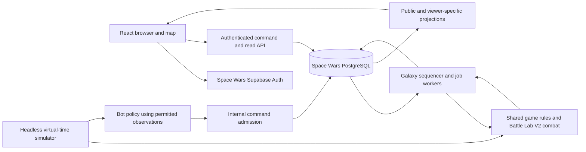

# Space Wars project architecture

Status: proposed architecture for owner review, 7 October 2026. This pass adds documentation only. Implementation, Supabase provisioning, migrations and deployment remain unapproved. The owner's selection of the Web game's **Battle Lab V2 top-down battle system** is a requirement, not an open engine choice.

Build an independently deployable TypeScript monorepo: React/Vite browser UI, a separate Supabase Auth/PostgreSQL backend, and one backend worker application for galaxy scheduling, bots and authoritative top-down combat. Reuse selected Space Explorer code and assets by copying reviewed versions into this repository. The principal new work is shared-world ordering and visibility, not authentication or rendering.

## Scope and architecture boundaries

The first playable milestone is one shared galaxy with Guest login, commander and civilization creation, homeworlds, planets, asteroids, Credits/Alloy/Fuel, four ship classes, fleets, movement, mining, neutral conquest, PvP, battle reports, bots and an event log. Plan Google login/linking into the account model; deliver it after the Guest vertical slice and before a public release where account recovery matters. No officers, research tree, market, guilds, battle pass or deep colony economy are required.



The browser renders information it is allowed to know and submits intentions. It cannot choose costs, elapsed time, rewards, combat results, ownership or another actor's identity. Countdown interpolation, a route preview and replay playback are presentation only. Server timers continue when every browser is closed.

The worker owns domain execution. Supabase RPCs enforce admission, identity, transaction boundaries, receipt uniqueness and commit constraints. Trusted TypeScript code evaluates the same rules for human and bot commands. An Edge function may adapt HTTP/auth and enqueue work; it must not start an untracked background simulation after returning a response.

## Recommended repository layout

The proposed layout is sound. Add a worker entry point, a domain orchestration package, persistence adapters and tests so these concerns do not accumulate in scripts or Edge handlers. Directories below are future structure, not scaffolding created by this audit.

```text
apps/
  web/                     React/Vite, galaxy map, account UI, battle viewer
  worker/                  one deployable process, scheduler/bot/combat task pools
packages/
  contracts/               public DTOs, command schemas, versions and errors
  game-rules/              pure economy/action validation and immutable catalogs
  galaxy/                  graph generation, movement, visibility and capture rules
  combat/                  extracted Battle Lab V2 engine, simulation and replay types
  bot-engine/              observation-only utility policies and bounded memory
  domain/                  action dispatch and deterministic event ordering
  persistence/             PostgreSQL adapter and commit/read contracts
supabase/
  migrations/              Space Wars-only schema, introduced in a later phase
  functions/               thin authenticated HTTP adapters where useful
scripts/
  simulations/             virtual clock, scenario runner and report exporters
tests/
  contracts/               golden vectors and adapter conformance
  integration/             real PostgreSQL/RLS/concurrency checks
  e2e/                     two browser contexts and reconnect flows
docs/
assets/                    approved originals, provenance and derivative metadata
```

Use npm workspaces and a single lockfile initially. Select and pin an actually supported Node/TypeScript/Vite toolchain during implementation; the two reference package manifests specify different engine/tool versions and should not be copied indiscriminately. No monorepo orchestration framework is needed initially.

Dependency direction: contracts and immutable definitions are leaves; galaxy/combat/bot policies are pure modules; domain combines rules; persistence and runtime applications provide I/O. Browser imports may include replay math and public catalogs, never persistence, worker credentials, hidden world state or future encounter seeds. Bot-engine receives an observation and legal action descriptions, not the database adapter. Break the reference combat engine's import of `components/game/topdown-art.ts` by extracting pure mount geometry/metadata into combat; retain image loading and Canvas drawing in web.

## State and identity

Separate account, actor and membership. Supabase Auth authenticates a human account; a galaxy actor is a commander with an optional human controller. A season membership connects an actor to one galaxy/season. Bots use the same actor and membership model without Auth users. Actor IDs, not Auth UUIDs, own fleets/resources; the server resolves which active actor an authenticated human can command.

Anonymous Supabase users have authenticated identities and can later link an identity. An unauthenticated request is a different case. Use separate Space Wars session/cache namespaces. See [Supabase anonymous sign-ins](https://supabase.com/docs/guides/auth/auth-anonymous). Linking must preserve actor membership; an already-used Google identity requires an explicit account switch, never an automatic merge or starter regrant.

Keep authoritative tables private to the backend where practical. Publish deliberate DTOs/tables for galaxy topology, ownership and scores; publish actor-bound DTOs for resources/orders and viewer-bound observations for enemy presence. See [PVP_SECURITY_MODEL.md](PVP_SECURITY_MODEL.md). RLS controls rows, while separate projections control which fields exist at all.

## Command execution and shared ordering

Use a durable command inbox and event queue, with a single logical sequencer per galaxy for the MVP. This is a process responsibility backed by PostgreSQL leases/fencing, not a new microservice. It is a conservative starting point for hundreds of actors, subject to measurement.

1. Admission derives the human actor from verified Auth, or checks a bot scheduler's narrow capability. It validates the envelope, rate limits, membership and season, persists an idempotent intent, and assigns the next open strategic tick. It returns a command ID and `PENDING`; admission is not successful spending or movement.
2. The sequencer processes closed ticks in the order defined in the security model. The shared domain layer evaluates legality against canonical state, including earlier due events. Failed actions receive terminal rejection receipts.
3. A short commit transaction verifies the worker fence, command identity, rules version and read versions, applies constrained effects, and writes receipts, ledgers and projection/event changes atomically. SQL constraints backstop uniqueness, nonnegative quantities and reservations. Browser credentials cannot invoke effect commit RPCs.
4. Combat snapshots/reservations commit first. CPU simulation runs outside database locks. A result is applied only through the battle settlement transaction at its scheduled strategic completion. Retries never reroll the seed.

Humans and bots share TypeScript domain validation. SQL independently enforces authorization and storage invariants; it is not a second hand-written copy of the whole combat or bot engine. The trusted runtime may compute effects, but commit functions accept only registered action/result shapes bound to the persisted input, context versions and current lease. Never expose a general client `apply_patch` or resource setter API.

Maintain actor revision for private state, fleet/system versions for affected aggregates, and a server-only galaxy sequence for ordered commits. Public and viewer event cursors are separate. Do not require clients to provide a current galaxy-wide revision; an unrelated battle must not invalidate a build request. The existing per-player revision pattern still helps with stale intentions but cannot serialize two players capturing the same system.

## Timers and battle execution

Use absolute server deadlines for builds, movement legs, mining cycles, capture and bot decisions. Store rules/version and paid costs with each job. Resource arithmetic uses bounded integer units or fixed-point with explicit rounding. Public timing estimates use server time plus monotonic elapsed browser time, then resynchronize after reconnect/focus.

A persistent worker checks due work frequently enough for 15-second builds; an initial 250–1000 ms polling cadence is a benchmark setting, not a promise. Use queue wakeups only as an optimization. PostgreSQL retains jobs, leases, attempts and deadlines across worker restarts. Bots do not need an open browser. Avoid a minute-only scheduler as the sole driver of 20-second travel.

Battle Lab V2 is the sole authoritative combat engine family for Space Wars. Give the adapted engine a new Space Wars version and catalog hash, pin its PRNG and input ordering, and preserve provenance to the original engine-10 source. Compute a battle once on the server from both sides' reserved ships. Simulate and Watch share the same outcome; Watch is a replay and never submits damage or settlement. The galaxy need not wait for the viewer's animation.

The proposed strategic battle occupancy is a fixed, versioned duration (initial experiment: 10 seconds); this is separate from simulated battle time and replay speed. At its deadline an unfinished worker blocks further galaxy event advancement rather than changing chronological outcomes. Commands can still be admitted as pending. This deliberate MVP bottleneck must pass combat/load tests; partitioning by independent systems/sectors is a later option if it fails. Do not silently let late worker results settle out of order.

## Read synchronization

Start with bootstrap plus cursor-based event polling, provisionally every 2 seconds in the foreground and slower while hidden. A map snapshot includes its topology/ownership version; private state has its own revision; observations carry `observed_at` and expiry. Missing or expired cursors require a fresh authorized snapshot. Cache by project/account/actor/galaxy/season/schema/rules version; clear active subscriptions and selections on identity changes.

Retain a durable outbox for ambiguous command submissions. Persist the request before sending; resend identical content with its original key. Do not queue speculative offline warfare or silently retry a rejected order with newer revisions. The UI distinguishes submitting, pending, applied, rejected and unavailable.

Add Realtime later as a latency improvement, sending invalidation hints or already-redacted projection events. Reconnect always reconciles via the durable read API. A private channel requires explicit authorization configuration; it does not automatically redact a payload. See [Supabase Realtime authorization](https://supabase.com/docs/guides/realtime/authorization). No raw private fleet/order table subscriptions. Public presence must not reveal hidden activity or fleet movement.

## Browser experience

Start the galaxy map with SVG systems/lanes/ownership outlines and an HTML side panel. Keep the graph/map state independent of the renderer so dense fleets, effects or thousands of nodes can move to Canvas after measurement. Five hundred player slots does not mean five hundred nodes; test a several-thousand-system map with viewport culling, aggregated labels and sector detail levels. Ownership borders are derived visuals; connected systems are the rules authority.

Desktop gets a central map, resources/event rail and selected system/fleet inspector. Mobile uses the same data model with a bottom sheet, touch selection and pan/zoom; provide a keyboard-accessible system list and labels beyond color. Use Canvas for the already-selected top-down battle viewer. Adapt the reference layout tokens and art loaders, not its complete RPG navigation or local save/session model.

## Deployment and isolation

Future deployment has three units: static web hosting/CDN, a dedicated Space Wars Supabase project, and one worker service near its database. Edge handlers live with that project where needed. No separate fleet/bot/combat microservices, Redis or message broker are required initially. Task pools in the worker may scale separately later without splitting domain ownership.

Use distinct disposable development/test environments and a separate production project when authorized. Every migration/deploy/test tool must require a Space Wars environment allowlist and fail when its expected project identity is missing or wrong. Never import reference `.env`, Supabase config, project IDs, storage endpoints or deployment scripts. Public web builds get only the Space Wars publishable configuration. Server credentials stay in runtime secret storage.

Deploy immutable rules alongside compatible workers before activating a release; retain old resolvers while their jobs/battles exist. Run the site independently with only this repository available in CI. No sibling-path imports, symlinks, workspaces pointing to reference projects or production asset hotlinks.

## Capacity and operational acceptance

Approximately 500 slots is a product capacity target, not verified throughput. Example load assumptions for tests: 500 connected viewers polling at 2 seconds implies up to 250 read requests/second before batching/caching; 500 bots choosing every 15 seconds implies roughly 33 decisions/second before event-triggered work. Test these separately from 500 registered but mostly idle actors.

Index jobs by pending status/deadline, events by authorized stream/cursor, memberships by controller and season, system occupancy and orders by location, and receipts by actor/season/key. Track commit/lock latency, queue age, action rejections, battle CPU/memory, event payload size, query counts and browser frame time. Bound fleet counts, ships per battle, route length, queue depth, simulation steps and retention. Avoid broadcasting the full galaxy or full actor state after each change.

A proposed acceptance budget is p95 normal command settlement under 2 seconds and due-event lag under 2 seconds at the agreed load, excluding explicit simulated travel/build time. Test bursts, reconnect storms and worker restarts. If the sequencer cannot meet it, optimize batching/read projections first; only then design sector ownership and cross-sector ordering. See [IMPLEMENTATION_PLAN.md](IMPLEMENTATION_PLAN.md) for approval gates and tests.
